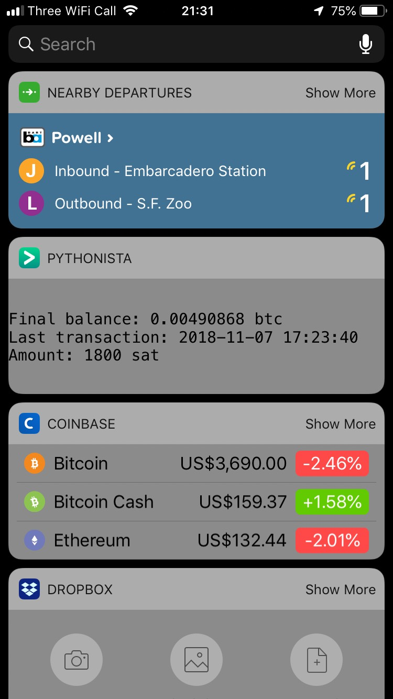
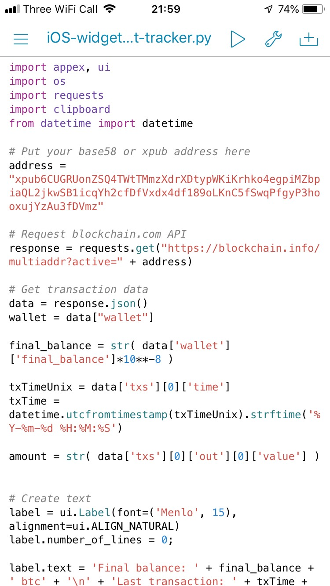
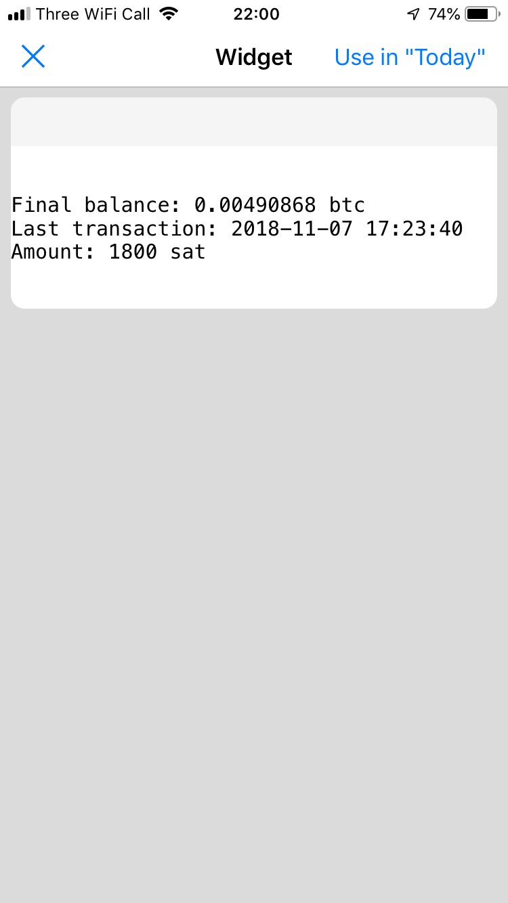

# iOS-widget-crypto-wallet-tracker
iOS Widget - cryptocurrency wallet tracker

This script can be run on an iphone or iphone with [Pythonista](http://omz-software.com/pythonista/) installed. 

Here is an example of what it looks like:

  To install it, download Pythonista and open the BtcWalletTracker.py script within the app:

  Run the script within the app and you'll see an example of what it'll look like.  
Hit "Use in 'Today'" and you'll be ready to go!

